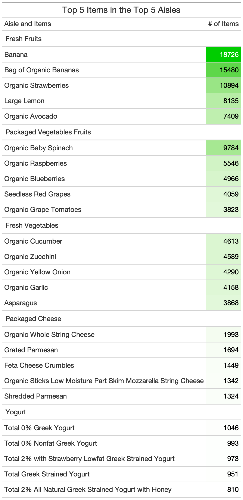

```{r, message=FALSE}
#Load the good stuff
library(tidyverse)
#Working directory for .RMD
knitr::opts_knit$set(echo = TRUE,
root.dir = rprojroot::find_rstudio_root_file())
#Controlling figure output in markdown
knitr::opts_chunk$set(
# fig.height = 4
fig.width = 6,
# fig.asp = .5,
out.width = "90%",
# out.height =
fig.align = "center",
cache = FALSE,
echo = TRUE
)
#Set Theme for ggplot2
theme_set(theme(plot.title = element_text(hjust = 0.5), legend.position = "bottom"))
#Set Scientific notation output for knitr
options(scipen = 999)
#```
```


```{r, message=FALSE}
library(readr)
instacart.df <- read_csv("data/instacart.csv")
```

```{r, echo=FALSE, eval=FALSE}
DataExplorer::plot_missing(instacart.df)
DataExplorer::plot_bar(instacart.df)
DataExplorer::plot_histogram(instacart.df)
```


## 3.1 Please create a gt summary table which describes the overall mean, median, and sd of the *number of days since last order*, *number of items purchased*, *number of aisles*, *number of departments*, *order number*, and *percent of items reordered*; for all customers’ orders in these data. (20pts)

```{r}
library(gt)
instacart.df %>%
  group_by(order_id) %>%
  summarize(days_since_prior_order = unique(days_since_prior_order), num_items =  n(), num_aisle = n_distinct(aisle_id), num_departments = n_distinct(department_id), order_num = unique(order_number), prop_reorder = sum(reordered)/n()) %>% #Creating desired variables
  pivot_longer(cols = c(order_num, days_since_prior_order, num_aisle, num_items, num_departments, prop_reorder), names_to = "vars", values_to = "vals" ) %>% #Make our table into long form
  group_by(vars) %>%
  summarize(Mean = mean(vals), Median = median(vals), S.D. = sd(vals)) %>% #Find mean, median, and sd for the variables
  mutate(vars = factor(vars), vars = fct_recode(vars,"# Days Since Last Order" = "days_since_prior_order", "# of Aisles" = "num_aisle", "# Items" = "num_items", "# Departments" = "num_departments", "% Reordered" = "prop_reorder", "Order Number" = "order_num")) %>% #Make variable names look better
  gt() %>%
  tab_header(title = "Mean, Median, and Standard Deviation for Customer Data") %>%
  cols_label("vars" = "Variables") %>%
  fmt_percent(columns = c(Mean, Median, S.D.), rows = 6) %>%
  fmt_number(columns = c(Mean, S.D.), decimals = 3, rows = 1:5) %>%
  as_raw_html()

```

The mean, median, and standard deviation for certain variables are displayed in the above table. This is for every customer's orders.

## 3.2 Create a visualization in ggplot 2 which displays the number of orders (of all products) per aisle, with aisles ordered in a meaningful way. (20pts)

```{r, fig.height=20}
instacart.df %>%
  mutate(aisle = stringr::str_to_title(aisle)) %>% #Make the aisle names capitalized
  group_by(aisle) %>%
  summarize(n = n()) %>%
  mutate(aisle = fct_reorder(aisle, n, .desc = F)) %>%
  ggplot(aes(x = aisle, y = n, fill = n)) +
  geom_col() +
  coord_flip() +
  labs(title = "Number of Orders per Aisle", x = "Number of Orders", y = "Aisle", fill = "# of Orders")
```

This plot shows the number of items ordered per aisle. The highest numbers are at the top and are colored in light blue at the highest values and goes down to dark blue at the lower values.

## 3.3 What are the top 6 aisles in the the top 6 departments by items purchased? Create a ggplot 2 visualization which displays this information, with departments and aisles ordered in a meaningful way. (20pts)

```{r}
dep_names <- instacart.df %>%
  mutate(department = str_to_title(department)) %>%
  count(department) %>%
  arrange(desc(n)) %>%
  head(6) #Take top 6 departments
```
```{r, message=FALSE}
instacart.df %>%
  mutate(department = str_to_title(department), aisle = str_to_title(aisle), department = factor(department), aisle = factor(aisle)) %>%
  filter(department %in% dep_names$department) %>% #Filter to only have the top 6 departments
  group_by(department) %>%
  count(aisle) %>%
  slice_max(order_by = n, n = 6) %>% #Take top 6 aisles
  summarize(n = n, aisle = aisle, tot_n = sum(n)) %>% #Need to add in a total for each department
  ungroup() %>%
  mutate(aisle = fct_reorder(aisle, desc(n))) %>%
  mutate(aisle = fct_reorder(aisle, desc(tot_n))) %>% #These order the variables the way we want them
  ggplot(aes(x = aisle, y = n, fill = fct_reorder(department, desc(tot_n)))) +
  geom_col() +
  labs(title = "Top 6 Aisles in Top 6 Departments by Items Purchased", x = "Aisle", y = "# of Items", fill = "Department") +
  theme(axis.text.x = element_text(angle = 90))
```

We grouped the aisles by the department and then ordered those groupings by how many aisles total there were in the top 6 (or top 5 in the case of Produce).


## 3.4 What are the top 5 aisles by items purchased and what are the top 5 items purchased in each of those aisles? Please display your answer in a single gt table. (20pts)

```{r}
aisle_names <- instacart.df %>%
  mutate(aisle = str_to_title(aisle)) %>%
  group_by(aisle) %>%
  count() %>%
  arrange(desc(n)) %>%
  head(5) #Take top 5 aisles
```

```{r, message=FALSE}
(gt_table3.4 <- instacart.df %>%
  mutate(aisle = str_to_title(aisle), aisle = factor(aisle)) %>%
  filter(aisle %in% aisle_names$aisle) %>% #Filter to only have the top 5 aisles
  group_by(aisle) %>%
  count(product_name) %>%
  slice_max(order_by = n, n = 5) %>% #Take the top 5 products for each aisle
  summarize(n = n, product_name = product_name, total = sum(n)) %>% #Get the total number of products in each aisle
  arrange(desc(total)) %>% #Order the rows by how many products are in each aisle
  select(aisle, product_name, n) %>%
  gt() %>%
  tab_header(title = "Top 5 Items in the Top 5 Aisles") %>%
  data_color(
    columns = n,
    colors = scales::col_numeric(
      palette = c("white", "green3"), 
      domain  = c(810, 18726))) %>% #Color the highest numbers in green
  gt::cols_label("product_name" = "Aisle and Items", "n" = "# of Items")) %>%
  as_raw_html()
```
```{r}
library(webshot)
gt_table3.4 %>%
  gtsave("./figures/Colorful_aisle_table.png")
```



The aisles in the table are ordered by how many products are in their respective top fives. Within the aisle we also ordered the products by their totals and displayed the top 5.